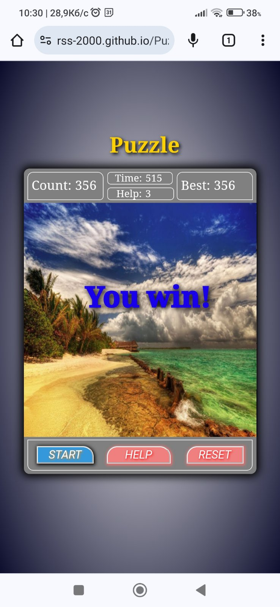
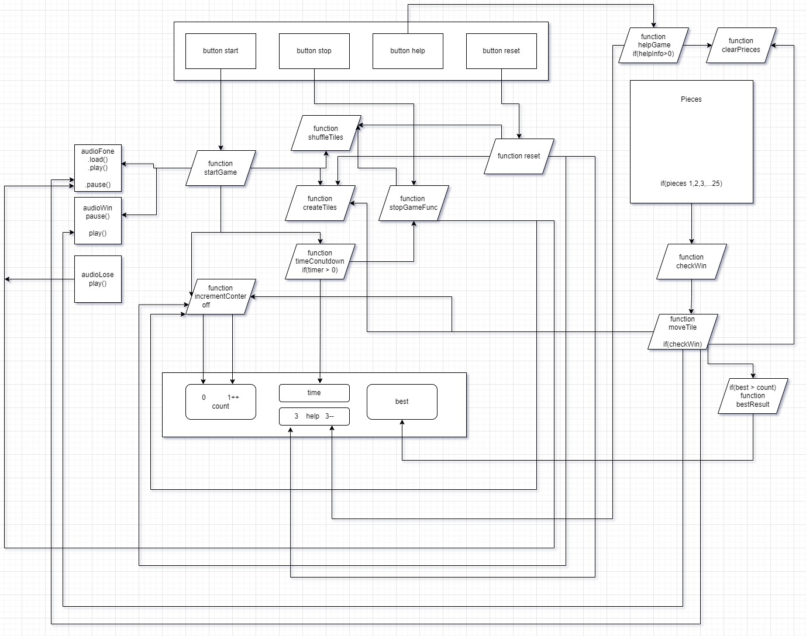

 # 🧩 Puzzle Game
>Hello, my name is **Sergey**!  
This is a simple puzzle game built with **HTML, CSS, and JavaScript**.  

## 🎮 Game Rules
- Complete the puzzle in **15 minutes** ⏱  
- You have **3 clues** to help you 💡  
- Each move is recorded in the **information window** 🔢  
- After the game ends, the **best score** (fewest moves) is shown 🏆  

## 🔨 Tech Stack
- [X] JavaScript  
- [X] HTML5  
- [X] CSS3  

---

## 🚀 Live Demo
👉 [Play Puzzle Game here](https://rss-777.github.io/Puzzle-game/)  

---

## 📸 Screenshots

  
  
 

---

## 🔗 Flowchart

---

## 📜 License
Free to use and modify. ⭐ If you like this project, consider giving it a star!
